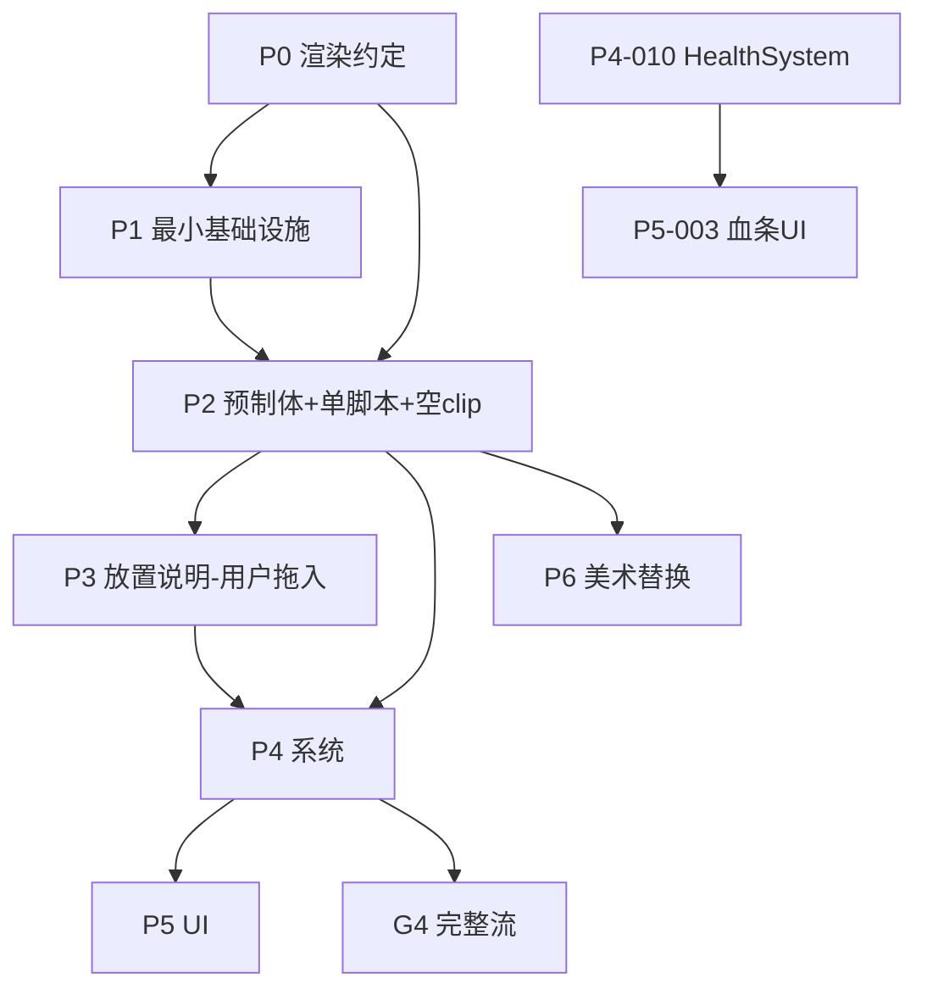

# Defense3 — Cursor AI 可执行任务清单 v2.0

> 引擎：**Cocos Creator 3.8.8** · 语言：**TypeScript**  
> 权威设计：`defense3.md`（项目根目录）  
> 动画帧区间：`docs/ANIM_MANIFEST.md`  
> 场景放置：`docs/SCENE_PLACEMENT.md`（AI 维护，用户在编辑器拖入）  
> 多 Agent 管线：`.cursor/`（已导入桌面「多agent协助管线」）

---

## §0 多 Agent 管线接入（必读）

### 0.1 管线组成

| 组件 | 路径 |
|---|---|
| Agents | `.cursor/agents/`（goal-agent / plan-agent / build-agent） |
| 规则 | `.cursor/rules/`（`defense3-workflow.mdc` 为项目硬约束） |
| 命令 | `/plan` `/new-feature` `/fix-bug` `/build-plan` `/replan` `/verify-plan` `/summary` |
| 计划 | `.cursor/plans/<slug>.md` |
| 报告 | `.cursor/plans/reports/<slug>-report.md` |
| 总结 | `.cursor/summaries/<slug>-summary.md` |

### 0.2 任务执行路由（禁止绕过）

| 任务规模 | 路由 | 流程 |
|---|---|---|
| **小**（≤2 文件、无接口破坏） | `@goal-agent` | 直接实现 → 极简报告；仍须跑该任务 AC |
| **中**（多文件 / 跨模块 / P2~P4 单任务） | `@plan-agent` → 用户审阅 → `/build-plan <slug>` | 计划落盘 → build-agent 执行 → `/verify-plan` |
| **大**（P4 系统级、P3 场景批次） | plan 内拆 **S1..Sn 子步骤** | 每个 S 独立 AC；失败 `/replan` |

**强制规则**：每个 P 任务 = 一个 plan 文件 + 一份执行报告 +（可选）`/summary`。禁止不建 plan 直接大范围改代码。

### 0.3 任务-管线映射表

| 任务 ID | plan slug | 路由 | 完成后 |
|---|---|---|---|
| P0 | — | 人工确认渲染约定 | 勾选 §P0 确认 |
| P1-001 | `p1-001-dirs` | goal-agent | `/summary p1-001-dirs` |
| P1-002~006 | `p1-00x-<name>` | goal-agent | 各任务 verify |
| P1-D01~D04 | 按需 | goal-agent | 触发时再建 plan |
| P2-001 | `p2-001-player` | **plan-agent** | `/build-plan` → `/verify-plan` |
| P2-002 | `p2-002-log` | plan-agent | 同上 |
| P2-003~014 | `p2-00x-<name>` | plan-agent | 同上 |
| P3-001 | `p3-001-main-scene` | goal-agent（用户编辑器创建） | 用户确认 |
| P3-002~006 | `p3-00x-<name>` | plan-agent | 产出 `SCENE_PLACEMENT.md` |
| P4-003~013 | `p4-00x-<name>` | plan-agent（含 S 子步骤） | `/verify-plan` |
| P5-001~006 | `p5-00x-<name>` | plan-agent | 同上 |
| P6-001~007 | `p6-00x-<name>` | plan-agent | 引用 ANIM_MANIFEST |

### 0.4 单任务 Prompt 模板

```
请按 AI_TASK_LIST.md 执行任务 [P?-???]：
1. 查映射表确定 slug 与 agent 路由
2. 中/大任务先 /plan 落盘 .cursor/plans/<slug>.md（含 AC 命令）
3. 严格遵守 defense3-workflow.mdc、§P0 渲染约定、脚本唯一性
4. 完成后 /verify-plan <slug> 并更新执行报告
```

---

## §P0 前置必读（所有 P2/P3/P6 之前确认）

### P0-A 渲染与层级约定（修复 Defense2 同类返工）

| # | 约定 |
|---|---|
| 1 | **节点结构**：`Root`（Transform + 物理 + 逻辑脚本）→ 子节点 `Visual`（Sprite + Animation + Billboard + SortingOrder2D） |
| 2 | **Billboard**：`lateUpdate` 仅绕 Y 轴朝向主相机；只旋转 `Visual`，不改 `Root` 物理旋转 |
| 3 | **SortingOrder2D**：`sortingOrder = Math.round(-visualNode.worldPosition.y * 100)`；取 **Visual 世界 Y** |
| 4 | **锚点**：Sprite `anchorY = 0`（脚底贴地） |
| 5 | **相机**：透视，俯角 ~45°，position 约 `(0, 15, 15)`，lookAt 道路中心；禁止正交 |
| 6 | **执行顺序**：先 Billboard 转正 → 再 SortingOrder2D 取世界坐标算 order |
| 7 | **2D 物理**：RigidBody2D 在 Root；碰撞体在 Root 或 Visual（全项目统一一种，推荐 Root） |

**AC-P0**：`rg "SortingOrder2D|Billboard" assets/scripts/core/` 有输出；计划/代码中 Visual 子节点结构一致。

### P0-B 脚本唯一性（禁止职责分裂）

| 对象 | 唯一脚本 | 禁止创建 |
|---|---|---|
| 玩家 | `Player.ts` | ~~PlayerController.ts~~ |
| 滚木 | `Log.ts` | ~~LogController.ts~~ |
| 小怪 | `EnemyMinion.ts` | — |
| Boss | `EnemyBoss.ts` | — |

跨对象流程用 `*System.ts` / `*Manager.ts`，不得再建同对象第二个脚本。

### P0-C 预制体命名（全小写 snake_case）

```
pref_player / pref_log / pref_enemy_minion / pref_enemy_boss
pref_build_plot / pref_wall / pref_tower_basic / pref_tower_advanced
pref_barracks / pref_hero_shrine / pref_hero_01 / pref_hero_02
pref_soldier_ranged / pref_soldier_melee
pref_item_log_extend / pref_item_bow / pref_item_coin
pref_trap_saw / pref_projectile_arrow / pref_skill_ultimate
pref_barrier_wall / pref_barrier_long / pref_joystick
pref_ui_coin / pref_ui_hero_select / pref_ui_hp_bar_player
pref_ui_hp_bar_enemy / pref_ui_hp_bar_boss / pref_ui_joystick_hint / pref_ui_game_over
```

**AC-P0-NAMING**：`rg "pref_[A-Z]" AI_TASK_LIST.md docs/` 无输出（无驼峰 pref 名）。

---

## 使用说明

1. **顺序**：P0 确认 → P1 最小集 → P2 预制体（含动画空 clip）→ P3 放置说明 → P4 系统 → P5 UI → P6 美术替换。
2. **占位资源**：图用 `default_sprite`；动画用空 `AnimationClip`（见 `docs/ANIM_MANIFEST.md`）。
3. **数值**：全读 `GameConfig`；「几下死」仅为初始 hp/attack 参考。
4. **塔防段切换**：`ParkourContent.active = false`，仅 `RoadRoot` 保留。
5. **场景**：AI 不改 Main.scene 大规模 JSON；产出 prefab + `docs/SCENE_PLACEMENT.md`，用户编辑器拖入。

### 通用 AC 命令（每个任务 plan 必须包含）

```bash
# AC-COMPILE：类型检查
npx tsc --noEmit -p tsconfig.json

# AC-NO-DUP-CONTROLLER：禁止重复控制器
rg "PlayerController|LogController" assets/scripts/ && exit 1 || true

# AC-NO-MAGIC-KILL：禁止硬编码击杀次数
rg "第[0-9]+下|hitsToKill|一击秒杀" assets/scripts/ && exit 1 || true
```

---

## 阶段一：项目初始化（最小集 P1-001~006 + 按需 P1-D）

> **原则**：仅保留 P2-001/002 立即可用的基础设施；对象池/状态机/ResourceUtil 等**用到再加**（P1-D 系列）。

### P1-001 目录结构

| 项 | 内容 |
|---|---|
| **slug** | `p1-001-dirs` |
| **目录** | `assets/scenes/`、`assets/scripts/core|game|ui|character|building|enemy|item|trap/`、`assets/resources/prefabs/{ui,character,building,enemy,item,trap,projectile}/`、`assets/resources/sprite/frames/`、`assets/resources/animations/`、`docs/` |
| **AC-1** | `test -d assets/scripts/core && test -d docs` → 退出码 0 |

### P1-002 Singleton

| slug | `p1-002-singleton` | 文件 | `assets/scripts/core/Singleton.ts` |
| AC | AC-COMPILE + `rg "class Singleton" assets/scripts/core/Singleton.ts` |

### P1-003 EventManager + GameEvents

| slug | `p1-003-events` | 文件 | `EventManager.ts`, `GameEvents.ts` |
| AC | `rg "PHASE_CHANGED|COIN_CHANGED|HP_CHANGED" assets/scripts/core/GameEvents.ts` |

### P1-004 GameConfig

| slug | `p1-004-game-config` | 文件 | `assets/scripts/core/GameConfig.ts` |
| 字段 | playerMaxHp, heroMaxHp, bossMaxHp, bossAttackDamage, minionMaxHp, soldierMaxHp, barrierMaxHp, 移动/滚木/建造/池上限 |
| AC | AC-COMPILE + AC-NO-MAGIC-KILL |

### P1-005 SortingOrder2D · P1-006 Billboard · P1-007 AnimUtil

| 任务 | 文件 | AC |
|---|---|---|
| P1-005 | `core/SortingOrder2D.ts` | 取 Visual 世界 Y；见 §P0-A |
| P1-006 | `core/Billboard.ts` | 仅 Y 轴旋转 Visual |
| P1-007 | `core/AnimUtil.ts` | `playAnim(node,'idle')` 不报错；映射见 ANIM_MANIFEST |

### P1-D 按需添加（触发时再建 plan，禁止 P1 阶段预建）

| ID | 触发条件 | 文件 |
|---|---|---|
| P1-D01 | P4-006 刷怪 | `ObjectPool.ts`, `PoolManager.ts` |
| P1-D02 | 首次阶段切换 | `GamePhase.ts`, `GameManager.ts` |
| P1-D03 | 首次 resources.load | `ResourceUtil.ts` |
| P1-D04 | 首次 tween | `TweenUtil.ts` |

---

## 阶段二：核心预制体（含逻辑 + 动画空 clip）

> 每对象 **一个主脚本**；动画 clip 在本阶段挂好（见 `docs/ANIM_MANIFEST.md`）。

### P2-001 玩家 `pref_player` + `Player.ts`

| 项 | 内容 |
|---|---|
| **slug** | `p2-001-player` |
| **唯一脚本** | `assets/scripts/character/Player.ts`（**含**跑酷/防守移动、RigidBody 驱动、攻击、大招；**禁止** PlayerController.ts） |
| **节点** | Root: RigidBody2D + Collider2D + Player；Visual: Sprite + Animation + Billboard + SortingOrder2D |
| **动画 clip** | idle / walk / parkour / meleeAttack / skill / die（空占位，路径见 ANIM_MANIFEST §player） |
| **AC-1** | AC-COMPILE |
| **AC-2** | `test ! -f assets/scripts/character/PlayerController.ts` |
| **AC-3** | `rg "class Player" assets/scripts/character/Player.ts` |
| **AC-4** | prefab 路径 `assets/resources/prefabs/character/pref_player.prefab` 存在 |

### P2-002 滚木 `pref_log` + `Log.ts`

| 项 | 内容 |
|---|---|
| **slug** | `p2-002-log` |
| **唯一脚本** | `assets/scripts/item/Log.ts`（**含**滚动、变长/砍断、黄线蓄力、蓝线固定/失败淡出、跑酷段流程；**禁止** LogController.ts） |
| **动画 clip** | roll（空占位） |
| **归属** | 实例挂 `ParkourContent` 下 |
| **AC-1** | AC-COMPILE |
| **AC-2** | `test ! -f assets/scripts/item/LogController.ts` |
| **AC-3** | `rg "class Log" assets/scripts/item/Log.ts` |

### P2-003 小怪 `pref_enemy_minion` + `EnemyMinion.ts`

| slug | `p2-003-enemy-minion` |
| clip | idle / walk / attack / die（空占位，帧区间见 ANIM_MANIFEST §enemy_minion） |
| AC | AC-COMPILE + pref 路径 `prefabs/enemy/pref_enemy_minion.prefab` |

### P2-004 Boss `pref_enemy_boss` + `EnemyBoss.ts`

| slug | `p2-004-enemy-boss` |
| clip | idle / walk / attack / die · ANIM_MANIFEST §enemy_boss |
| 数值 | bossMaxHp, bossAttackDamage 读 GameConfig |

### P2-005 `pref_build_plot` + `BuildPlot.ts`

| slug | `p2-005-build-plot` |
| 结构 | 背景、金币图标、费用 Label、建筑预览、绿色 vertical 填充条 |
| 碰撞 | Trigger Collider2D |

### P2-006 `pref_wall` + `Wall.ts`

封楼梯停刷怪；受击闪红（程序动画，P6-003）

### P2-007 `pref_tower_basic` / `pref_tower_advanced` + `Tower.ts`

塔顶 3 小兵远程攻击；士兵血量读 GameConfig.soldierMaxHp

### P2-008 `pref_barracks` + `Barracks.ts`

解锁立即出兵；8 放置点；出兵间隔读 GameConfig

### P2-009 `pref_hero_shrine` + `HeroShrine.ts`

解锁后弹英雄二选一 UI

### P2-010 `pref_hero_01` / `pref_hero_02` + `Hero.ts`

| clip | idle / walk / attack / die · ANIM_MANIFEST §hero_01 |
| 弹道 | pref_projectile_hero_01 / pref_projectile_hero_02 |

### P2-011 `pref_soldier_ranged` / `pref_soldier_melee` + `Soldier.ts`

| clip | 远程：remoteAttack/idle/die；近战：meleeAttack/idle/die |

### P2-012 道具

| ID | prefab | 脚本 |
|---|---|---|
| a | pref_item_log_extend | LogExtendItem.ts |
| b | pref_item_bow | BowItem.ts |
| c | pref_item_coin | Coin.ts |

### P2-013 陷阱与弹道

| ID | prefab | 脚本 | 备注 |
|---|---|---|---|
| a | pref_trap_saw | SawTrap.ts | 挂 ParkourContent |
| b | pref_projectile_arrow | Arrow.ts | |
| c | pref_skill_ultimate | UltimateSkill.ts | |
| d | pref_barrier_wall / pref_barrier_long | Barrier.ts | 带血条 |

### P2-014 摇杆 `pref_joystick` + `Joystick.ts`

跑酷仅左右；防守全方向；输出方向向量给 Player.ts

**P2 通用 AC（每个 plan 必含）**：
- AC-COMPILE
- AC-NO-DUP-CONTROLLER
- `rg "default_sprite|Animation" assets/resources/prefabs/` 对应该 prefab 有引用
- clip 名与 ANIM_MANIFEST 一致

---

## 阶段三：场景（AI 产出说明，用户编辑器操作）

> **角色边界**：AI **不**大规模改 `Main.scene`；产出/更新 `docs/SCENE_PLACEMENT.md` + 所需 prefab；**用户在 Cocos 编辑器拖入**。

### P3-001 创建 Main.scene

| 执行者 | 用户（编辑器） |
|---|---|
| AI 职责 | 提供相机参数（§P0-A #5）、节点层级模板 |
| AC | 用户确认场景可打开、无 missing script |

### P3-002 道路分层

更新 `docs/SCENE_PLACEMENT.md`：
- `RoadRoot`：Road / SideWalls / Stairs（塔防段保留）
- `ParkourContent`：SawTraps / PreSpawnEnemies / LogSpawn / YellowLine / BlueLine（塔防段隐藏）

### P3-003 刷怪点 · P3-004 建造地块 · P3-005 拓展区

均在 `SCENE_PLACEMENT.md` 记录空节点名、坐标建议、关联 prefab。

### P3-006 SceneSetup.ts

| 项 | 内容 |
|---|---|
| **职责** | 缓存场景节点引用；**仅**实例化动态对象（敌人、金币等）；静态布局以编辑器为准 |
| **AC** | `rg "find\(|getChildByName" assets/scripts/game/SceneSetup.ts` 仅在 onLoad 出现 |

---

## 阶段四：核心系统

> **已删除** v1.1 的 P4-001 PlayerController、P4-002 LogController（合并入 P2-001/002）。

### P4-003 CombatSystem（射箭）

依赖 P2-012、P2-013

### P4-004 CoinSystem

依赖 P2-012c、P5-001

### P4-005 BuildSystem

### P4-006 EnemySpawner

触发 P1-D01 对象池

### P4-007 EnemyAI

### P4-008 SoldierManager

### P4-009 HeroManager

### P4-010 HealthSystem ⚠️ 先于血条 UI

| 项 | 内容 |
|---|---|
| **文件** | `assets/scripts/game/HealthSystem.ts` |
| **职责** | `takeDamage(damage)` / `heal` / 死亡事件；maxHp 读 GameConfig |
| **依赖** | P1-004、P1-003（**不依赖** P5 血条） |
| **AC-1** | `rg "takeDamage" assets/scripts/game/HealthSystem.ts` |
| **AC-2** | AC-NO-MAGIC-KILL |
| **AC-3** | 单元测试：`tests/health-system.test.ts` 覆盖 hp 归零 |

### P4-011 UltimateSystem · P4-012 CameraController

### P4-013 PhaseTransition（跑酷段隐藏）

| AC | `rg "ParkourContent" assets/scripts/game/PhaseTransition.ts` |

**P4 大任务 plan 必须拆子步骤**：例 `p4-005-build` → S1 解锁条件 / S2 扣费 / S3 生成建筑 / S4 事件广播

---

## 阶段五：UI 系统（依赖 P4-010）

### P5-003 血条系列（依赖 HealthSystem 事件，非反之）

| 预制体 | 脚本 | 依赖 |
|---|---|---|
| `pref_ui_hp_bar_enemy` | `HpBarEnemy.ts` | HealthSystem 的 `HP_CHANGED` |
| `pref_ui_hp_bar_boss` | `HpBarBoss.ts` | 同上 + 缓冲条 |
| `pref_ui_hp_bar_player` | `HpBarPlayer.ts` | 同上 |

### P5-001 CoinUI · P5-002 HeroSelectUI · P5-004 JoystickHint · P5-005 GameOver · P5-006 UIManager

---

## 阶段六：美术替换与特效打磨

> clip 名不变，只替换 `docs/ANIM_MANIFEST.md` 中帧区间对应的序列帧。

### P6-001 按 ANIM_MANIFEST 导入序列帧

| AC-1 | `ls assets/resources/sprite/frames/player/idle/frame_000.png`（或占位说明） |
| AC-2 | clip 名与 P2 一致：`rg "idle|walk|attack" docs/ANIM_MANIFEST.md` |

### P6-002 TweenUtil 接入（触发 P1-D04）· P6-003 FlashRed · P6-004~007 特效打磨

---

## 阶段化质量门禁（禁止 P1 阶段跑全流程手测）

| 门禁 | 触发时机 | 可执行验证 |
|---|---|---|
| **G0** | 每个任务完成 | AC-COMPILE + 该任务 plan 内 AC |
| **G1 跑酷段** | P2-001/002 + P3-002 + SceneSetup 后 | 手测：推滚木→电锯→黄线→蓝线；`ParkourContent` 存在 |
| **G2 战斗金币** | P4-003/004/010 + P5-001/003 后 | 手测：拾弓→射箭→掉金币→血条变化 |
| **G3 建造段** | P4-005 + P2-005~009 后 | 手测：建墙→塔→兵营 |
| **G4 完整流** | P4-011 + P5-005 后 | 手测全流程 + `/summary` 功能总结 |

```
G1 不可跳过 G0；G2 不可跳过 G1；以此类推。
P1 阶段只允许 G0，禁止勾选 G1~G4。
```

---

## 推荐执行顺序

| 顺序 | 任务 | 说明 |
|:---:|---|---|
| 0 | §P0 确认 | 渲染约定 + 命名 + 脚本唯一性 |
| 1 | P1-001 ~ P1-007 | 最小基础设施 |
| 2 | P3-001 | 用户编辑器建空场景 |
| 3 | P2-001, P2-002, P2-014 | 玩家+滚木+摇杆（单脚本）→ **G1** |
| 4 | P3-002~006 | 更新 SCENE_PLACEMENT.md |
| 5 | P2-003, P2-012, P2-013 | 敌人+道具+陷阱 |
| 6 | P1-D02, P4-010, P4-003, P4-004, P4-013 | 状态机+血量+战斗+阶段隐藏 → **G2** |
| 7 | P5-001, P5-003 | 金币UI+血条（在 HealthSystem 之后） |
| 8 | P2-005~009, P4-005 | 建造 → **G3** |
| 9 | P2-010, P5-002, P4-009 | 英雄 |
| 10 | P3-005, P2-013d, P4-011 | 拓展+结束 → **G4** |
| 11 | P5-004~006, P6-* | UI 剩余 + 美术替换 |

---

## 任务依赖图



---

*v2.0 | 2026-08-31 | 接入多 Agent 管线 · 修复脚本分裂/命名/依赖/AC/场景边界/动画前置*
